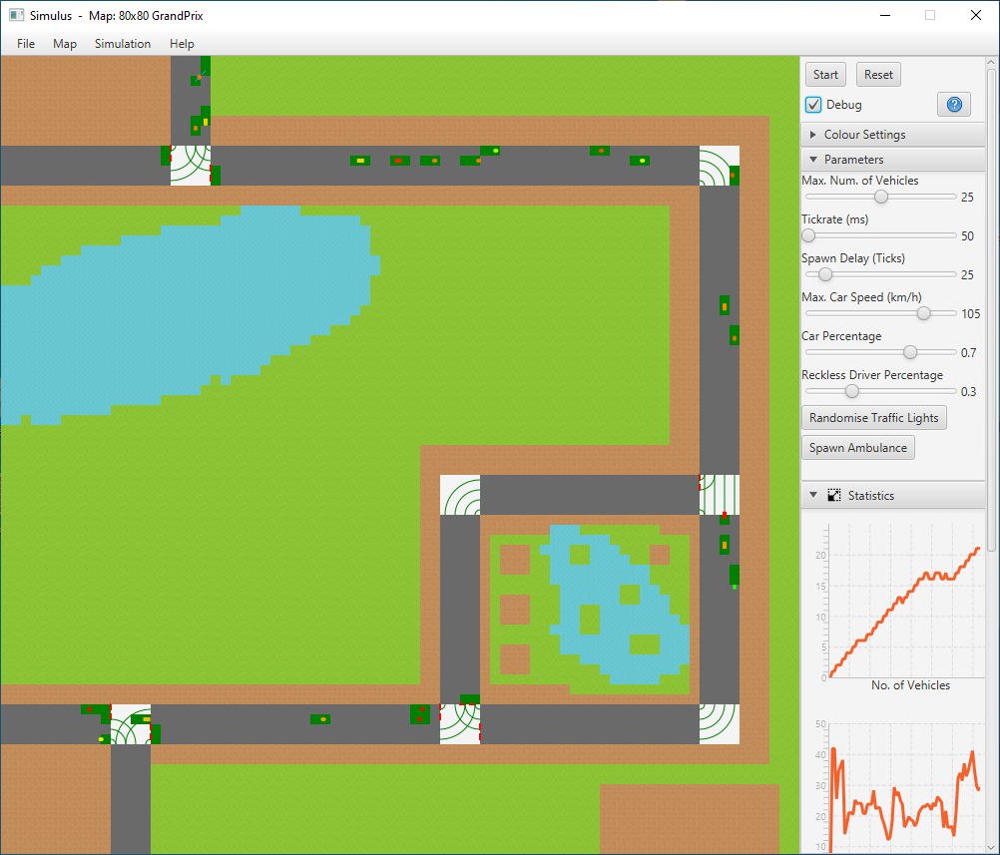
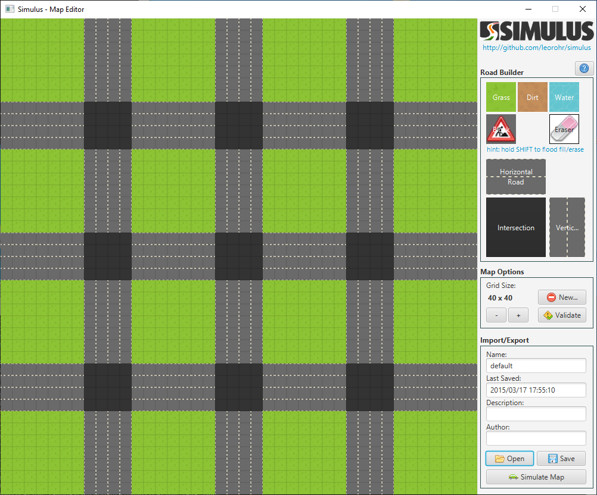

# Simulus

A traffic simulator, combining cellular automata with continuous
space models, written in Java, and using the JavaFX framework for visulation.

This code is a fork from [leorohr/7ccsmgpr_2015](https://github.com/leorohr/7ccsmgpr_2015) where it was originally hosted. However, the original content is no longer available.

The work was completed as part of a group project for a postgraduate Master's course at King's College London, accompanied by a paper titled ***"Combining Cellular Automata with Continuous Space Models in Traffic Simulation"***.

The sole contributors to this work are the members of [Team Simulus](https://github.com/leorohr/7ccsmgpr_2015/blob/master/team_simulus/members.txt).

> The main simulator app with a map loaded

> The map editor allowing construction of custom maps

**Features**
- Individual vehicle simulation
- Diverse vehicle behaviours
- Vehicle entrance & exit
- Vehicle tagging by behaviour and speed
- Simulation statistics and exporting as csv
- Traffic management policies
- Emergency services vehicles
- User-defined maps and map editor
- Import/export of maps and Settings

## Why

I was curious to revist the project, and having spent several hours fixing deprecated code, and not being able to get Ant build working, I thought I'd upload a working version for anyone else interested in this domain.

## Running Simulus
I've included a packaged Jar file and the JavaFX library required to run it. You can always compile the source yourself.

Assuming you have Java runtime on your machine, and have navigated to the simulus root directory, then run in your shell:

`$ java --module-path lib/lib --add-modules javafx.controls,javafx.fxml -jar bin/simulus.jar`

## Building Simulus

Assuming you have Java SDK on your machine, and have navigated to the simulus root directory, then run in your shell:

`javac -d bin -cp "lib/lib/*" $(find src -name "*.java")`

To then run the compiled application:

`javaw --module-path "lib/lib" --add-modules javafx.controls,javafx.fxml -classpath "bin;lib/lib/javafx.base.jar;lib/lib/javafx.controls.jar;lib/lib/javafx.fxml.jar;lib/lib/javafx.graphics.jar;lib/lib/javafx.media.jar;lib/lib/javafx.swing.jar;lib/lib/javafx.web.jar;lib/lib/javafx-swt.jar;lib/lib/jdk.jsobject.jar;lib/lib/jfx.incubator.input.jar;lib/lib/jfx.incubator.richtext.jar" com.simulus.Startup")`

Note: you'll need to copy the **"resources"** folder from **"/src"** to your build directory e.g. **"/bin"**